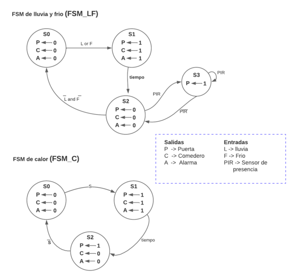
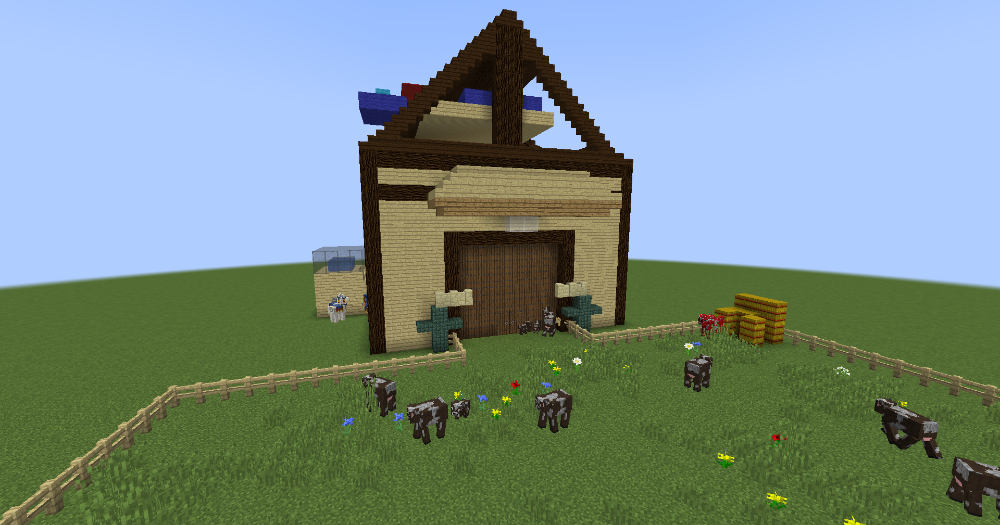
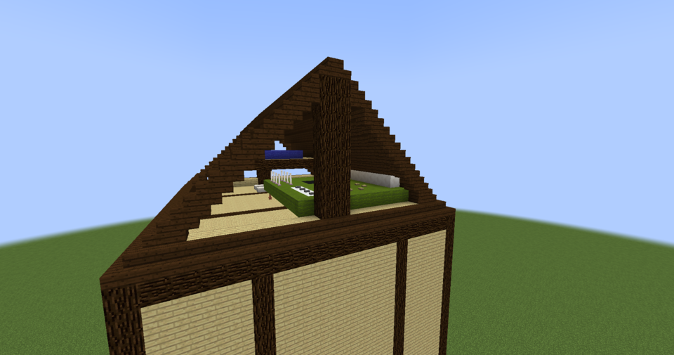
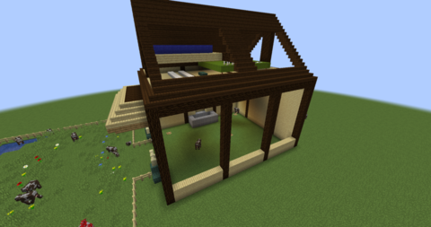

# Granja Automatizada

  

## Presentación equipo de Trabajo

### Presentado por:

Felipe Cubillos

Laura Alejandra Páez

Sergio Andres Moreno

### Docentes:

Diego Alexander Tibaduiza

Johnny Cubides

### Asignatura:

Electrónica Digital I

### Departamento:

Ingeniería Eléctrica y Electrónica

### Institución:

Universidad Nacional de Colombia

## Descripción General

A lo largo de este repositorio en **GitHub** se exhibirán una serie documentos, archivos de audio y video, archivos en VHDL y otra serie de elementos que condensan el trabajo realizado por parte de algunos estudiantes de la *Universidad Nacional de Colombia*, para la asignatura de *Electrónica Digital I- semestre 2023-1*, el cuál se enfocó en el desarrollo de un sistema de protección para animales de granja (especifícamente para granjas lecheras) en caso de estar expuestos a situaciones climáticas extremas,  el cuál tiene por nombre ***Granja Automatizada***. De manera que sea posible poner en práctica los conocimientos adquiridos a lo largo del curso en contextos dónde es de gran importancia su implementación, como lo es el el sector agropecuario de Colombia, influyendo así en la revolución tecnológica en el campo. 

## Identificación del Problema y alcance

El cambio climático ha sido uno de las mayores problemáticas a lo largo de los últimos años.Y, como consecuencia de esto, las condiciones climáticas han presentado variaciones significativas al punto de  exponer a los seres vivos a condiciones extremas de temperatura que perjudican su bienestar. 

Estas situaciones han provocado a su vez diversas afecciones en sectores de gran importancia económica para nuestra nación como lo es el sector agropecuario, pues varios ganaderos, lecheros y demás promotores de la producción animal han sido los más perjudicados debido a la poca adaptación de muchas de sus especies a estos cambios climáticos. Llegando a provocar un sin número de enfermedades y pérdidas económicas, impidiendo un progreso efectivo para el sector del agro colombiano. 

Por este motivo, y con el fin de contrarrestar estos efectos, se pensó en desarrollar un sistema de protección automático para los animales de granja (específicamente para aquellos animales que pertenecen al sector ganadero y lechero) que los resguarde ante cambios climáticos que puedan afectarlos.

## Antecedentes 
La agricultura ha sido uno de los mayores contribuyentes en materia de crecimiento económico del país a lo largo de los años, lo que ha permitido que Colombia sea un país cuyos bienes provengan en gran medida de la tierra y el tratamiento que se le da a esta . Sin embargo, su lugar e importancia en el sector económico se ha visto perjudicada debido a la poca competitividad que esta representa a comparación con el mercado exterior, pues la poca profundización en materia tecnológica ha hecho de este un sector algo obsoleto. Sin embargo, debido a los desarrollos tecnológicos y la facilidad de acceso a estos, ha sido posible idear prácticas y métodos que mezclen ambos mundos de manera que el campesino común no vea inalcanzable la posibilidad de competir y/o hacer parte de los principales contribuyentes en la cadena de producción de bienes. 

## Análisis PESTAL del problema

### Político
+ El desarrollo de una reforma agraria por parte del actual gobierno de manera que su implementación no sea instantánea si no que, por el contrario, pueda extenderse a períodos presidenciales posteriores y el sector agropecuario.
  
+ Establecimiento de algún mecanismo de control económico como por ejemplo algún  impuesto.
  
+ La implementación de normas y resoluciones asociadas al sector agropecuario podrían limitar las acciones que el campesino común puede ejercer, de manera que exista una ligera restricción a la libertad en su forma de trabajar.
  
### Economico 
+ Incrementos en la inflación podrían provocar aumentos en los precios de ciertos insumos que contribuyen a la producción de bienes, de manera que las cadenas productivas podrían verse afectadas y con ello las relaciones comerciales entre los actores económicos.
  
+ La implementación de tecnologías y prácticas ambientales puede tener un costo inicial más alto, pero a largo plazo puede tener beneficios económicos y ambientales.
  
+ La falta de oportunidades económicas en las zonas rurales es una de las principales razones para la migración de los jóvenes y adultos en busca de mejores oportunidades en las ciudades.
+ 
+ La disminución de la población en las zonas rurales puede afectar la productividad y rentabilidad de la agricultura y la ganadería, lo que a su vez puede afectar la economía del país.
  
### Social 
+ Tras la migración de la población más joven, las zonas rurales quedarán habitadas en su mayoría por adultos mayores. A largo plazo estas zonas quedarán aún más deshabitadas por la alta tasa de mortalidad en comparación con la de natalidad.

+ El aumento de la inseguridad a causa de la criminalidad por parte de inmigrantes extranjeros y la presencia de grupos armados  genera el desplazamiento de la población en búsqueda de una mejor calidad de vida.
  
+ A largo plazo las zonas rurales estarán más deshabitadas debido al descenso en la tasa de natalidad por la preferencia de las parejas actuales en no tener hijos.

### Tecnológico
+ La falta de infraestructura, los altos costos de la tecnología y la falta de financiamiento pueden limitar la adquisición de herramientas y tecnologías necesarias para mejorar la productividad y la rentabilidad en la agricultura y la ganadería.
  
+ La implementación de tecnologías puede requerir una mayor inversión en capacitación y recursos humanos para asegurar su correcta implementación y uso por parte de los pequeños y medianos productores rurales.
  
+ La tecnología puede ser una solución para aumentar la productividad y rentabilidad en la agricultura y la ganadería, pero también puede generar una dependencia tecnológica y limitar la diversificación de las actividades económicas en las zonas rurales.
  
### Ambiental

+ Los impactos del cambio climático, como la desertificación, la erosión del suelo, la sequía y las inundaciones, pueden afectar la disponibilidad, la calidad ,la productividad y rentabilidad de los pequeños y medianos productores rurales. Además, la falta de prácticas sostenibles y la explotación intensiva de los recursos naturales pueden afectar la biodiversidad y el equilibrio ecológico de las zonas rurales.
  
### Legal

+ El marco legal y regulatorio puede afectar la implementación de soluciones tecnológicas y la adopción de prácticas sostenibles en la agricultura y la ganadería. Las políticas gubernamentales pueden ser restrictivas o promotoras de tecnologías y prácticas sostenibles, lo que afectará a los pequeños y medianos productores rurales.

+ La legislación laboral puede influir en la mano de obra disponible para la agricultura y la ganadería, lo que puede afectar la productividad y la rentabilidad de los productores. Además, las regulaciones laborales pueden impactar en la automatización y en la implementación de soluciones tecnológicas.

+ Las regulaciones ambientales pueden influir en las prácticas agrícolas y ganaderas y en la implementación de soluciones tecnológicas sostenibles. Las regulaciones ambientales pueden ser restrictivas o promotoras de prácticas sostenibles, lo que afectará a los pequeños y medianos productores rurales.

## Diagramas

A continuación se muestran los diversos diagramas que describen el contenido y funcionamiento del proyecto, de manera que a través de ellos sea más sencilla la comprensión en relación a las conexiónes entre cada uno de sus elementos y cómo es posible que lleve a cabo cada uno de los procesos que ejecuta.

### Diagrama de Caja Negra

  

### Diagrama de Flujo de la solución

  

### Diagrama de estados (Máquina de estados) 

  

 

## Simulaciones 

 A continuación se muestran las simulaciones de cada uno de los diagramas de estados relacionados al clima, así cómo del contador empleado para la continuidad de la alarma. 
 
### FMS Calor

  

### FMS con tiempo

  
</p

### FMS Lluvia-Frío

### Contador Vista general

## Desarrollo proyecto

### Diseño Inicial

Para porder implemetar de manera más sencilla y visual cada uno de los 
sensores como también los actuadores, se decidió construir una maqueta de 
una granja, la cual su diseño inicial se realizo en Minecraft donde cada cubo hace
la representación de 1 cm en la realidad. 

En la anterior imagen se puede observar la parte frontal donde se pueden ver el 
PIR como los servomotores de la puerta:

Las 2 imágenes anteriores se presenta una primera organización de todo lo necesario 
para su funcionamiento. 

A lo largo del montaje final se cambiaron ciertas medidas y organizaciones a las presentadas en estos diseños.
### Pruebas de montaje

Funcionamiento de los servos:

A continuación se observa la prueba de montaje de la puerta:
[pruebas](Imágenes/Pruebas/Prueba_Puerta.mp4)

[test](https://github.com/SergioM11112/P-Automated-Farm/raw/main/Im%C3%A1genes/Pruebas/Prueba_Puerta.mp4)

[pruebas](Imágenes/Pruebas/Prueba_Puerta.mp4)

## Video del funcionamiento
Para visualizar el video por favor copee el link que se observa a continuación:

https://youtu.be/dM4KYdypnsU

## Referencias

+ https://www.scielo.cl/scielo.php?script=sci_arttext&pid=S0301-732X2008000100002#:~:text=El%20clima%20afecta%20al%20ganado,y%20el%20uso%20de%20%C3%A9sta
+ https://es.statista.com/estadisticas/1337047/valor-de-la-produccion-agricola-en-colombia/
+ https://portalechero.com/colombia-que-esta-pasando-en-realidad-con-la-produccion-de-leche-cual-es-su-futuro/

