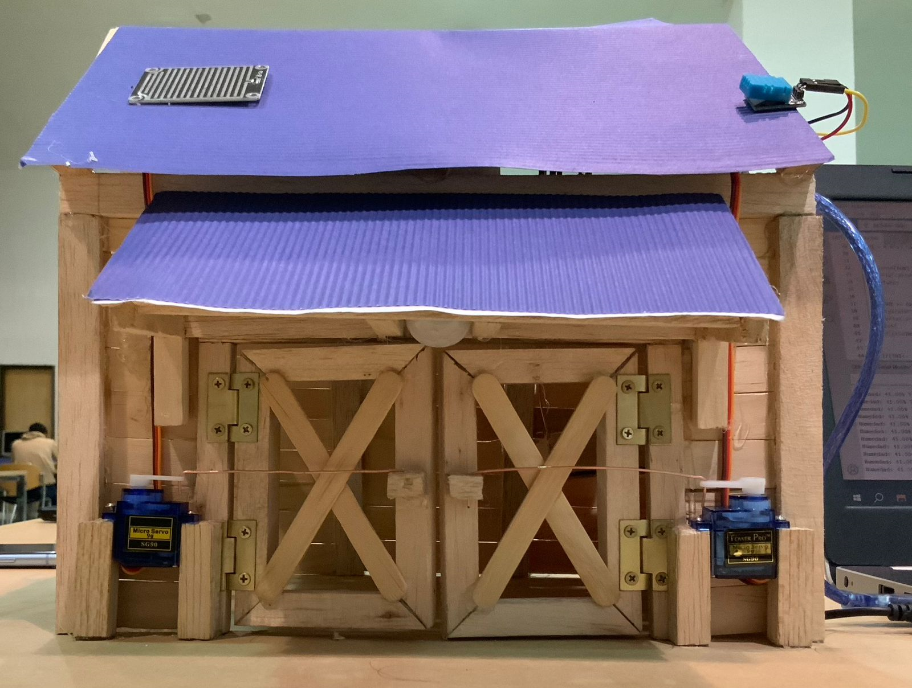
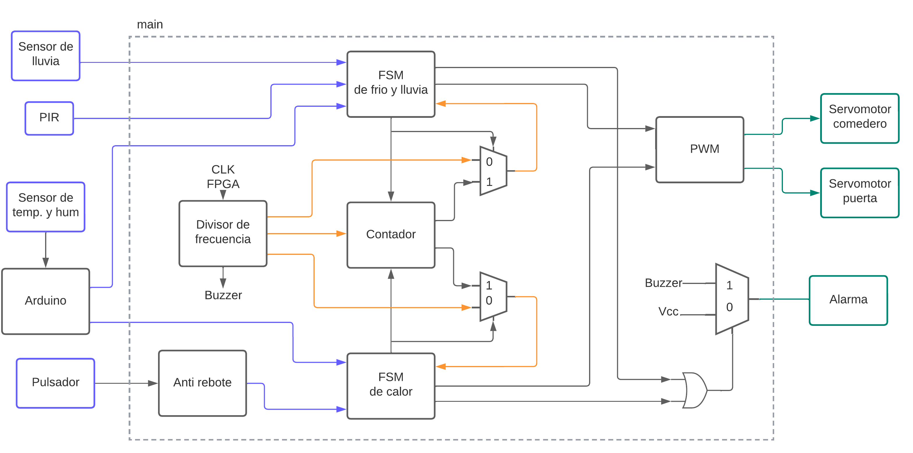
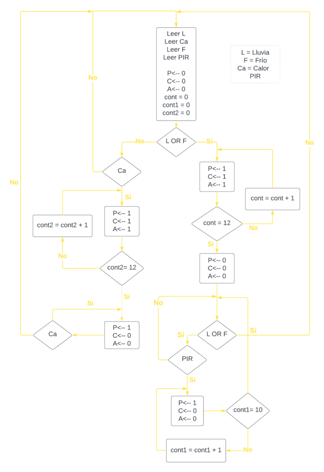
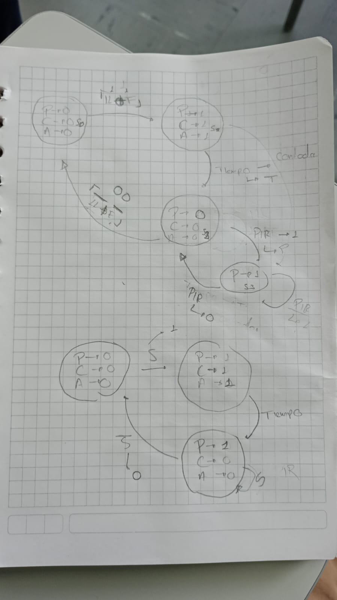
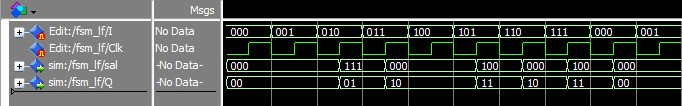
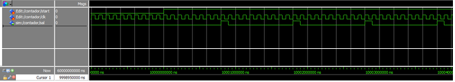

# Granja Automatizada

# Contenido
## Presentación equipo de Trabajo

### Presentado por:

Felipe Cubillos

Laura Alejandra Páez

Sergio Andres Moreno

### Docentes:

Diego Alexander Tibaduiza

Johnny Cubides

### Asignatura:

Electrónica Digital I

### Departamento:

Ingeniería Eléctrica y Electrónica

### Institución:

Universidad Nacional de Colombia

## Descripción General

A lo largo de este repositorio en **GitHub** se exhibirán una serie documentos, archivos de audio y video, archivos en VHDL y otra serie de elementos que condensan el trabajo realizado por parte de algunos estudiantes de la *Universidad Nacional de Colombia*, para la asignatura de *Electrónica Digital I- semestre 2023-1*, el cuál se enfocó en el desarrollo de un sistema de protección para animales de granja (especifícamente para granjas lecheras) en caso de estar expuestos a situaciones climáticas extremas,  el cuál tiene por nombre ***Granja Automatizada***. De manera que sea posible poner en práctica los conocimientos adquiridos a lo largo del curso en contextos dónde es de gran importancia su implementación, como lo es el el sector agropecuario de Colombia, influyendo así en la revolución tecnológica en el campo. 

## Identificación del Problema y alcance

El cambio climático ha sido uno de las mayores problemáticas a lo largo de los últimos años.Y, como consecuencia de esto, las condiciones climáticas han presentado variaciones significativas al punto de  exponer a los seres vivos a condiciones extremas de temperatura que perjudican su bienestar. 

Estas situaciones han provocado a su vez diversas afecciones en sectores de gran importancia económica para nuestra nación como lo es el sector agropecuario, pues varios ganaderos, lecheros y demás promotores de la producción animal han sido los más perjudicados debido a la poca adaptación de muchas de sus especies a estos cambios climáticos. Llegando a provocar un sin número de enfermedades y pérdidas económicas, impidiendo un progreso efectivo para el sector del agro colombiano. 

Por este motivo, y con el fin de contrarrestar estos efectos, se pensó en desarrollar un sistema de protección automático para los animales de granja (específicamente para aquellos animales que pertenecen al sector ganadero y lechero) que los resguarde ante cambios climáticos que puedan afectarlos.

## Diagrama de Caja Negra
  

Imágenes/Diagrama_de_cajas.png
Imágenes/Diagrama_de_Flujo_Proyecto.png
Imágenes/Diag_estados_V1.jpeg

## Diagrama de Flujo de la solución

## Diagrama de estados (Máquina de estados) 

## Simulaciones 

### FMS Calor

### FMS con tiempo

### FMS Lluvia-Frío

### Contador Vista general

## Video
https://youtu.be/dM4KYdypnsU

## Referencias

+ https://www.scielo.cl/scielo.php?script=sci_arttext&pid=S0301-732X2008000100002#:~:text=El%20clima%20afecta%20al%20ganado,y%20el%20uso%20de%20%C3%A9sta
+ https://es.statista.com/estadisticas/1337047/valor-de-la-produccion-agricola-en-colombia/
+ https://portalechero.com/colombia-que-esta-pasando-en-realidad-con-la-produccion-de-leche-cual-es-su-futuro/

